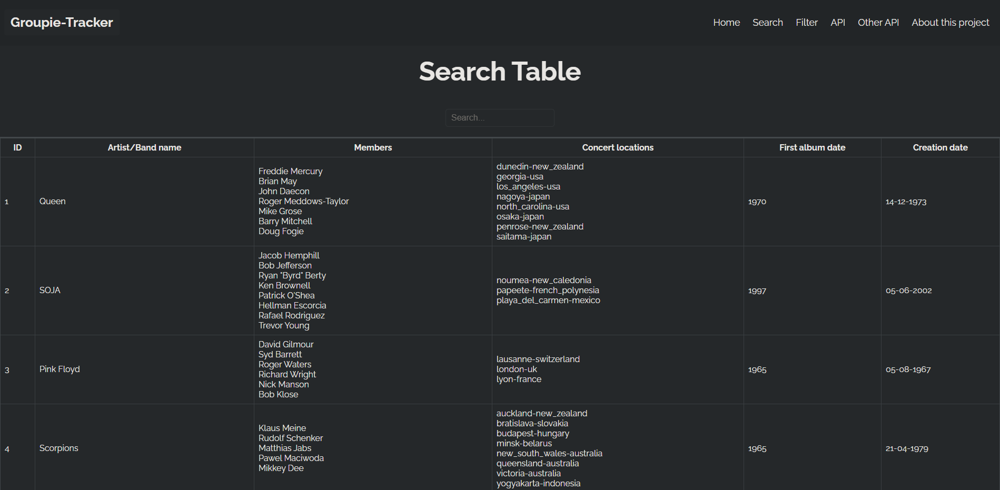
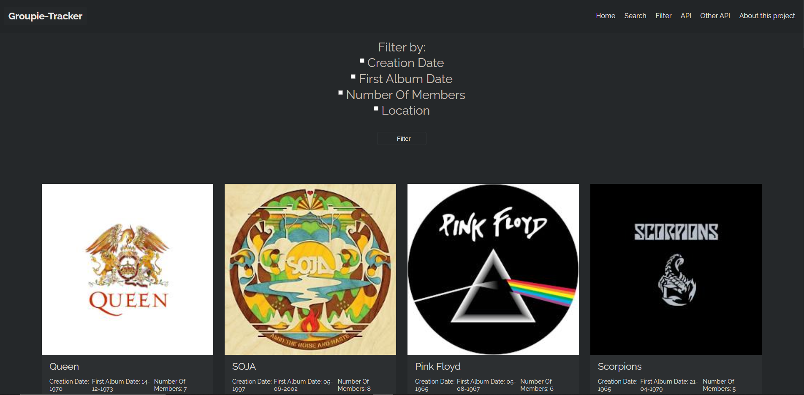

# Groupie-tracker 🎸

## Presentation

Groupie Trackers consists on receiving a given API and manipulate the data contained in it, in order to create a site,
displaying the information. This project also focuses on the creation of events and on their visualization.Groupie
Tracker contains information about some bands and artists like their name(s), image, in which year they began their
activity, the date of their first album and the members, their last and/or upcoming concert locations etc.
/groupie-tracker is a Go webapp that displays an API on a website.

## Usage

```
$ go build
$ ./groupie-tracker
```

or

```
$ go build
$ PORT=1111 ./groupie-tracker
```

and open http://localhost:1111 in your browser

## Options

### - Search Bar

  <br/>
  

### - Filter

  <br/>
  

### Front-end:

- HTML
- CSS
- JS

### Back-end:

- Go

### Used APIs:

- Groupie Tracker API
- Here MAP API

### Errors management:

- 400: Bad Request
- 404: Page Not Found
- 500: Internal Server Error

### Other API Example:

[Rick and Morty API](https://rickandmortyapi.com/)
